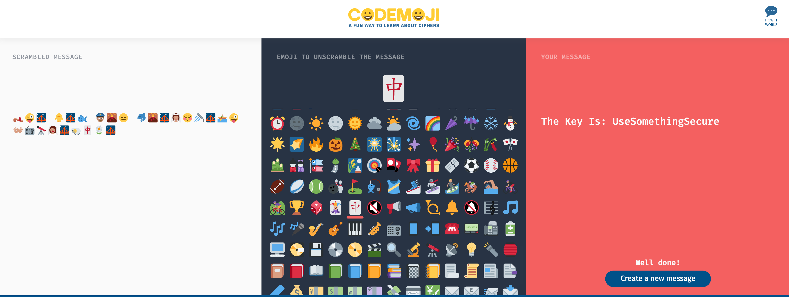

# DJ 200

This one was pretty easy. We're given a link: [https://mzl.la/2ccVnkW](https://mzl.la/2ccVnkW)

and it has a message:

 

Basically the way this site works is you encode/decode with an emoji. There's a finite amount of decode options, so I just tried each one until I found the one that worked.

 
