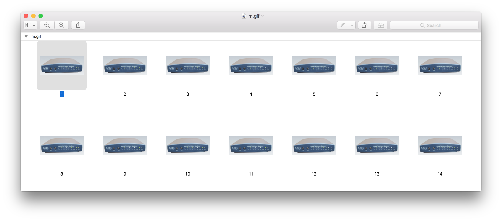

# Description

The clue leads you to a website with the image below.

# Solution

The lights on the modem are blinking kinda strangely for a modem.
Maybe the lights are a message.  It turns out there are 75 frames
(individual images) in the animation shown by the Preview.app
screenshot below.

The program [modulator.go](modulator.go) is a
[go](https://golang.org/) program that
samples one pixel of each LED.  If the light is Green (ON), we
treat it as a '1' and if it is White (OFF), we treat it as a '0'.
Each frame is treated as a separate byte. Most significant bit
is the RD light and MR is the least significant bit (PW is ignored).

Note: I believe this may be my first go program.

# Result

`YourFlagIsInHereIPromiseHereItIs{...}`
