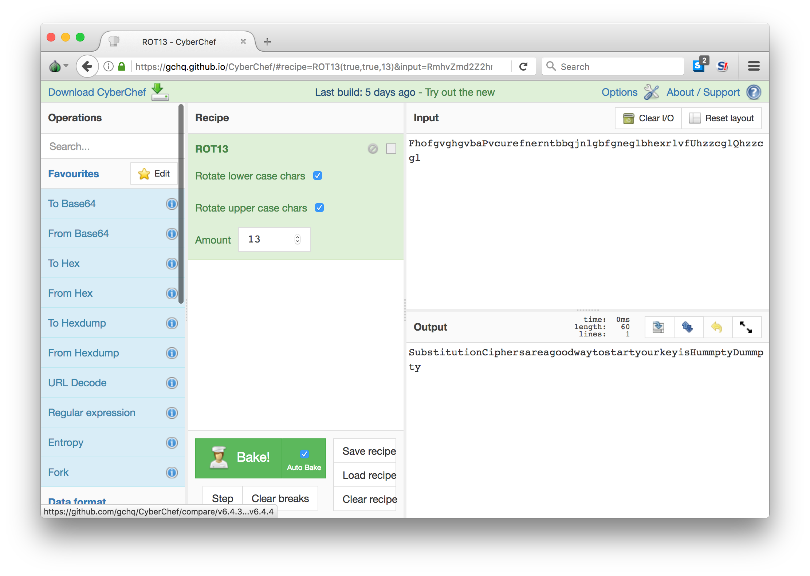

# Description

```
Challenge: Substitution

The basics of beginning crypto, it is very useful to understand how to crack a basic substitution cipher.

===================================

Decode the following cipher text and submit the key:
Fhofg vghgv baPvc urefn erntb bqjnl gbfgn eglbh exrlv fUhzz cglQh zzcgl
```

This is [ROT13](https://en.wikipedia.org/wiki/ROT13), which is really
just a variation of the Caesar cipher.

The secret decoder ring looks like the text below (A becomes N, B becomes O, and so on).

```
ABCDEFGHIJKLMNOPQRSTUVWXYZ
NOPQRSTUVWXYZABCDEFGHIJKLM
```

If you want to get fancy, cyberchef can do ROT13, too.


