# NoRE4U
I like reverse engineering, at least, at a hobbyist level. When I saw there was one that hadn't been solved yet, I thought "why not", and started working on it.

The binary was written to skip the good stuff:

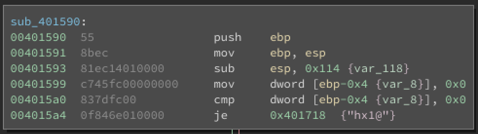

In C, this looks like
``` C
if (FALSE)
{
    // do the good stuff
}
```

I got around this by patching the `JE` with a `JNE`, to force execution down the right path. This is where stuff got hairy.

When I tried to run the patched executable, it hung for awhile and then crashed:

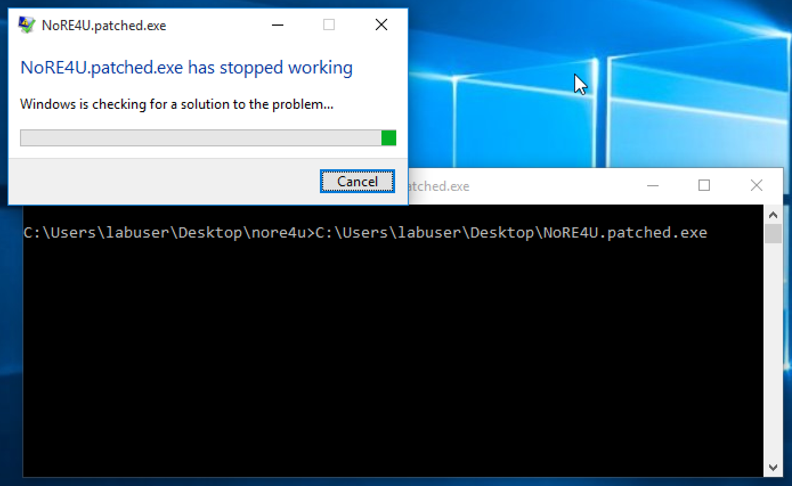

When I tried to debug the program, it kept hitting breakpoints and sleeping, so it became apparent (as the title of the challenge suggests) that there were anti-analysis techniques at play. I made some tendies and settled in for a long night.

## Anti-analysis techniques

### IsDebuggerPresent (`sub_401090`)

The first thing I did was attempt to identify the anti-analysis techniques. Thankfully, some of the common suspects showed up in the strings: `GetTickCount`, `IsDebuggerPresent`, etc. I focused on `IsDebuggerPresent` and found where it was used:

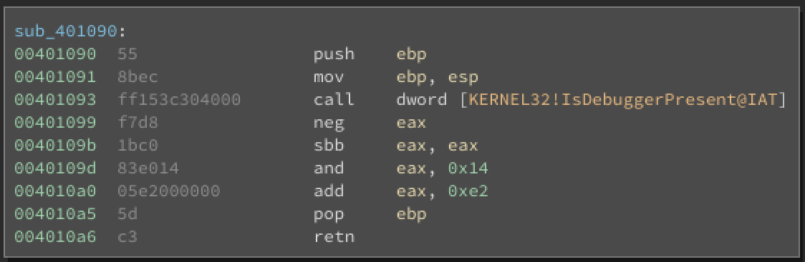

Looking at the MSDN, `IsDebuggerPresent` returns nonzero if there is a debugger attached, and 0 if there is no debugger attached.

It took me a solid 10 minutes to figure out what the `neg/sbb` combination does, but in short, it results in EAX containing 0 if it was originally 0, and 0xffffffff if it contained anything else. Weird, I know.

So the result of this function looks like this in C:

``` C
if (IsDebuggerPresent())
  return 0xF6;  // 0x14 + 0xE2
else
  return 0xE2;
```

I felt great about this! I backed out of the function, and had a reality check; this was one of 16 different anti-analysis techniques...

After looking at the main routine, the flow of execution is:
- Execute a subroutine that performs debugger/virtualization check
- Subroutine performs check, and returns the correct byte if we pass the check and an incorrect byte if we fail
- Repeat for all checks
- Bytes are placed into a buffer
- Buffer is used as ARC4 key (recognizeable for 0x100-loops and key expansion)
- String is ARC4-decrypted, and checked for `Flag:` at the beginning
- If decryption succeeds, the flag is printed, otherwise, a message is printed indicating failure

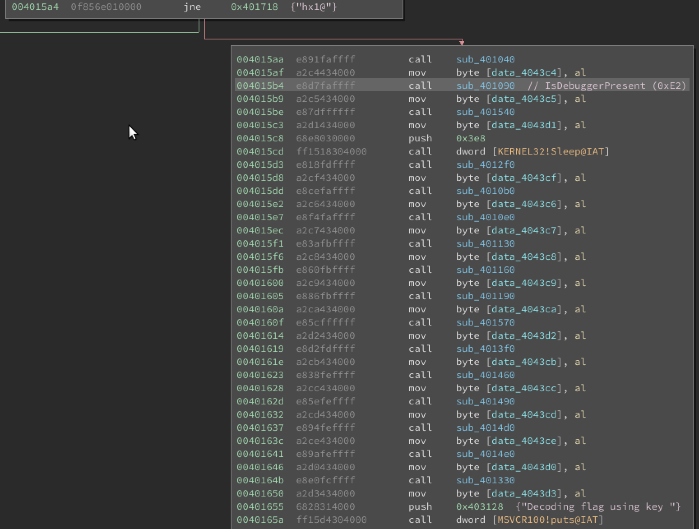

So I would need all 16 key bytes to get the flag. Game on! The following is a list of the other techniques used to evade dynamic analysis.

Returns: `0xe2`

### Setup (`sub_401040`)


This function returns a static byte, so is essentially a freebie. But it also does some setup that will be useful later:
- Executes `GetTickCount` and stores the result in a global variable
- Spawns a thread and stores the HANDLE in a global variable.

The thread runs forever, and continuously causes debug interrupts, which would be painful if running in a debugger.

Returns: `0x21`

At this point, I decided to remove the checks entirely by patching the binary. Since each check looks like this:
- Call subroutine
- Move result into array

I decided to replace the calls to the check functions, with `mov` instructions to place the expected result into EAX.


### CheckRemoteDebuggerPresent (`sub_401540`)

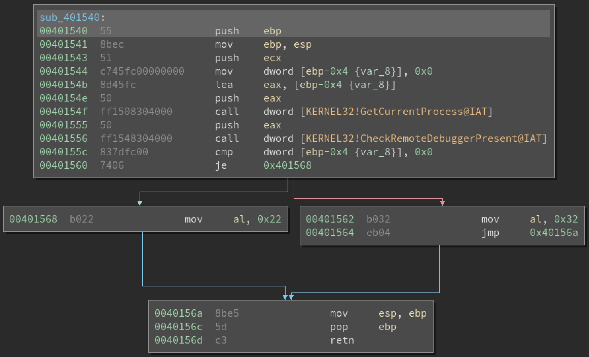

According to MSDN, this returns FALSE (0) if not being debugged.

Returns: `0x22`

### FindWindow (`sub_4012f0`)

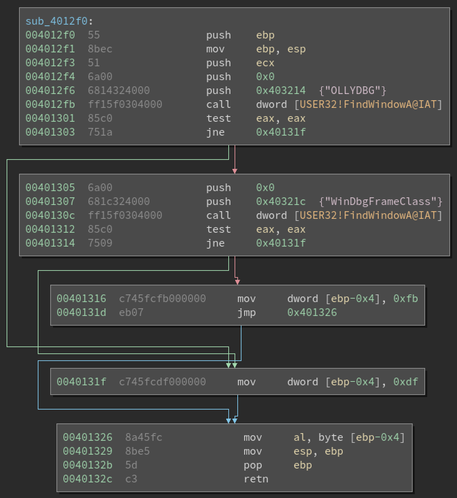

This technique checks if any windows are open with the following class names:
- WinDbgFrameClass
- OLLYDBG

Hmmm, both popular debuggers, guessing we don't want that call to succeed!

Returns: `0xfb`

### PEB #1 (`sub_4010b0`)

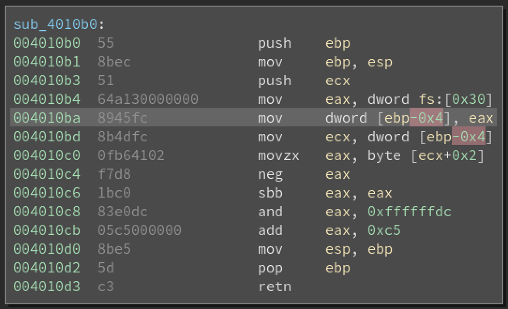

This function checks the value stored at an offset of 0x2 into the PEB, which according to [the MSDN](https://msdn.microsoft.com/en-us/library/windows/desktop/aa813706(v=vs.85).aspx) contains a boolean value indicating whether a debugger is attached.

Returns: `0xc5`

### OutputDebugString (`sub_4010e0`)

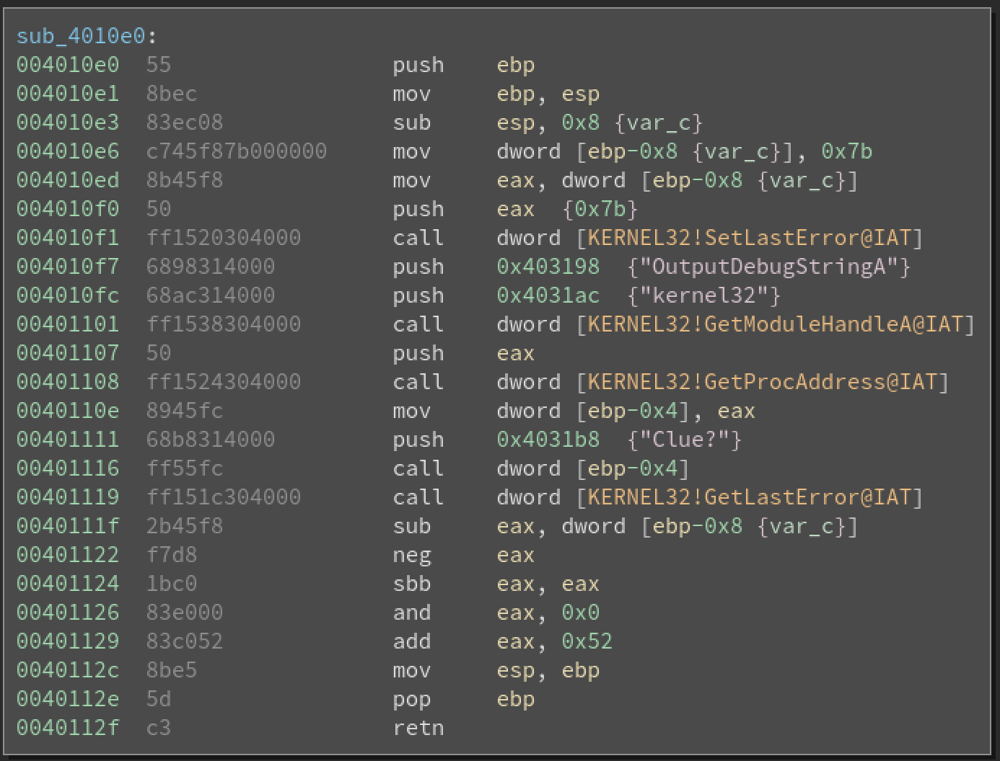

This technique checks whether a debugger is attached by
- Setting the last error code
- Calling `OutputDebugString`
- Checking the last error code

If there is no debugger attached, the call to `OutputDebugString` will set an error code. If there is a debugger attached, the error code will not be affected.

Note: This one is a freebie, because at the end of the function, EAX is set explicitly to `0x52`. This could be a compiler optimization, error, unrolled macro, or something else. In this case, I talked to the author of the challenge (Professor Plum), who mentioned he had issues with the challenge and decided to just hardcode the return value.

Returns: `0x52`

### GetTickCount (`sub_401130`)


This is an oldie but goodie. The program gets the "tick count", or number of CPU ticks since last reboot, and checks it again later. If a debugger is attached and breakpoint is hit, this delta will be much larger than expected.

So, we end up with the following:
```
00401134  ff1510304000       call    dword [KERNEL32!GetTickCount@IAT]
...
00401140  2b05c0434000       sub     eax, dword [orig_TickCount]
00401146  3dd0070000         cmp     eax, 2000
0040114b  1bc0               sbb     eax, eax
0040114d  25d4000000         and     eax, 0xd4
00401152  83c01d             add     eax, 0x1d
```

Checks whether `currentTickCount - originalTickCount < 2000`. If so, return `0xd4 + 0x1d`, otherwise return `0x1d`. Since the delta being larger would imply that a debugger is likely attached, we want the former case.

Returns: `0xf1`

### GetExitCodeThread (`sub_401160`)


This function checks the exit code of the thread that was spawned during setup. This is the thread that runs forever, and annoys you with debug breaks, so if that thread is dead it indicates patching or some other circumvention by an analyst.

Returns: `0xfb`

### Process list search (`sub_401190`)

I won't provide a screenshot because there's a lot going on here. But this check uses the Toolhelp process list snapshot API to get a list of processes, and checks if there are any matches in this list of analysis tools:
- wireshark
- OLLYDBG
- windbg
- idaq
- python
- tasmgr
- Procexp
- procmon
- pslist
- fiddler

Returns: `0x3a`

### Sleep? (`sub_401570`)

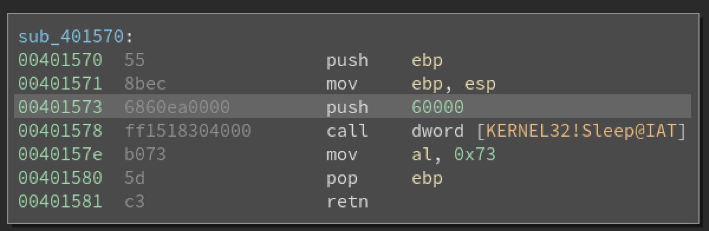

This may have just been thrown in to slow down automated patching/bruteforcing, or frustrate an analyst? Hardcoded return value

Returns: `0x73`

### SEH handler (`sub_4013f0`)

This one threw me off and thwarted me to the end.

What you see here is setting up structured exception handling (one of the exception handling mechanisms in Windows C/C++):

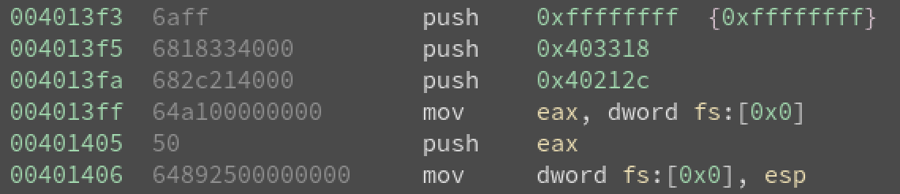

One of those pointers (`0x403318`) points to an SEH structure that contains a few other function pointers:
- a filter function (i.e. "am I intended to handle this type of exception?")
- the code that executes if the filter returns TRUE.

There's kind of a lot going on in this function, likely generated by the compiler rather than the coder, but here's the main attraction:


In this snippet, the `idiv` instruction is dividing by zero!

If a debugger is attached, it will catch that exception. Otherwise, the handler will execute, and cause a different value to be returned:

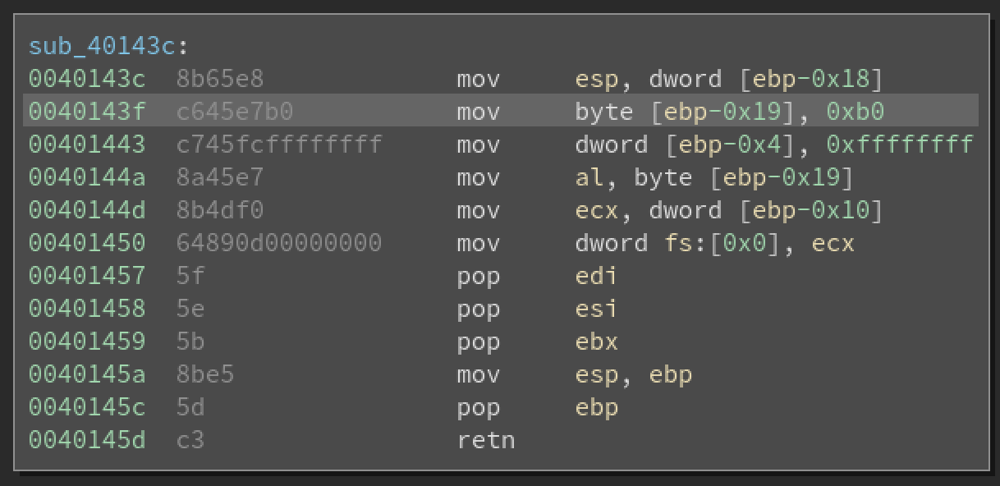

Amongst all the SEH stuff, you'll see a value being moved into `EAX` (or it's lowest byte, `AL`).

Returns: `0xb0`

### PEB #2 (`sub_401460`)

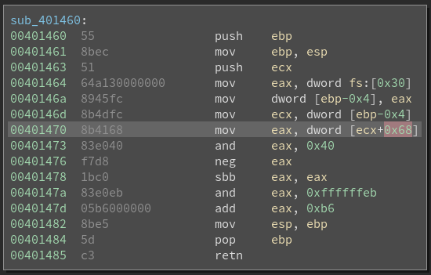

This reference to the PEB checks offset `0x68` into the PEB, which is the `NtGlobalFlag` field. If the process is being debugged, the following flags are set in this field:
- FLG_HEAP_ENABLE_TAIL_CHECK
- FLG_HEAP_ENABLE_FREE_CHECK
- FLG_HEAP_VALIDATE_PARAMETERS

This binary checks specifically if the FLG_HEAP_VALIDATE_PARAMETERS bit is set; we want that check to be FALSE.

Returns: `0xb6`

### NtQueryInformationProcess (`sub_401490`)

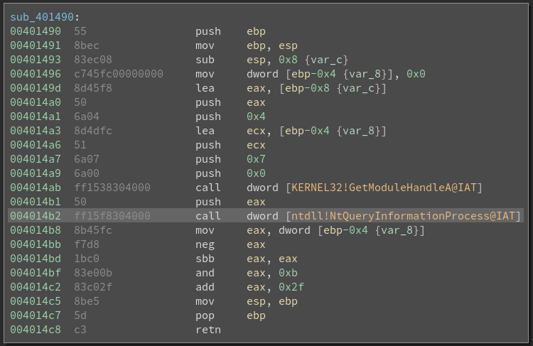

This API (not surprisingly) allows you to retrieve information about the process. The binary queries for `ProcessDebugPort`, which would return the port number of the debugger attached to the process. If 0 is returned, no debugger is attached.

Returns: `0x2f`

### CloseHandle (`sub_4014d0`)

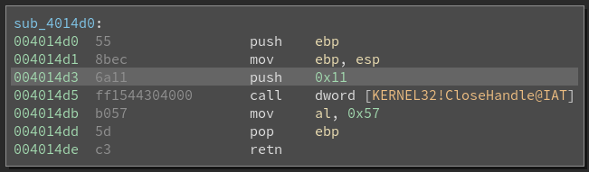

This once again feels like a no-op, but after reading the MSDN for `CloseHandle`, the call will throw an exception if an invalid handle is passed in AND a debugger is attached - that might be what the developer was going for.

Returns: `0x57`

### no-op and debug break check (`sub_4014e0`)

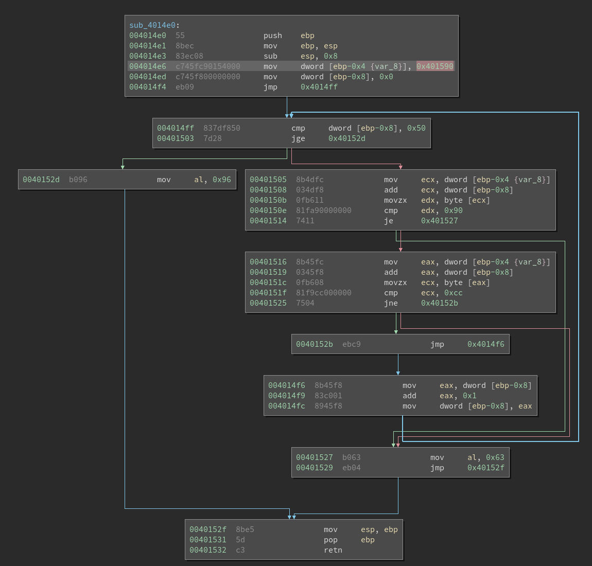

This performs a simple check for binary patching! It iterates over the main function, checking for `0x90` (Intel no-op instruction) and `0xcc` (soft debug break) that may have been placed there by an analyst.

(NOTE: We toggled the jump instead of no-op'ing it out at the beginning of our analysis, so this check would not have caught that)

Another form of this that is common is to calculate a checksum over the potentially affected data, which would have caught our jump-toggle and would catch artificial no-op sequences like `push eax; pop eax`

Returns: `0x96`

### Virtualization check (`sub_401330`)

I was too tired by the time I got here...

First the binary calls `__cpuid([], 1)`, which returns feature bits of the processor. It then checks if `0x80000000` is set in the third (index=2) element of the result array, which is "reserved" according to [this MSDN article](https://msdn.microsoft.com/en-us/library/hskdteyh(v=vs.100).aspx). I was confused by that, as that bit should never be set.

The binary then calls `__cpuid([], 0x40000000)`, which I was unable to finf in the documentation... I assumed that the first check would fail (being run against reserved bits) and moved on.

## Result

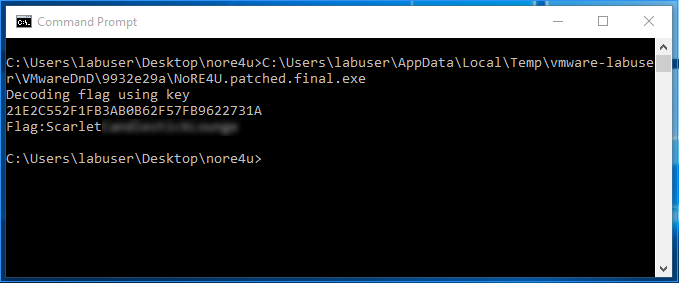

## Alternate method of solving the puzzle

I did not solve all these techniques correctly the first time, so I ended up solving the challenge by brute-forcing!

Recall that each anti-analysis check returns one of two values: if the test is passed, it returns the correct byte, otherwise it returns something else, but both are hardcoded.

Once I had changed all the function calls to `xor eax, eax; mov al, <byte>` sequences, I wrote a Python script to generate all combinations of potentially correct return values, and it found the working binary on iteration #657!

I've included that script, in all its ugliness, in case you're curious.

## Possible alternate method?

I sadly don't own hardware running Windows, but I suspect you could patch that initial jump and the binary might work fine on hardware... which would obviously haved saved me the 5-6 hours of my life I spent working on this!

## Tools used
- Binary Ninja (static analysis and manual binary patching)
- VMWare running a Windows virtual machine and a Linux virtual machine (where I did most of the analysis)