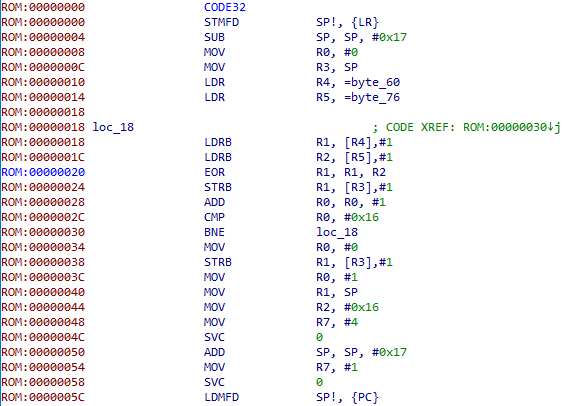
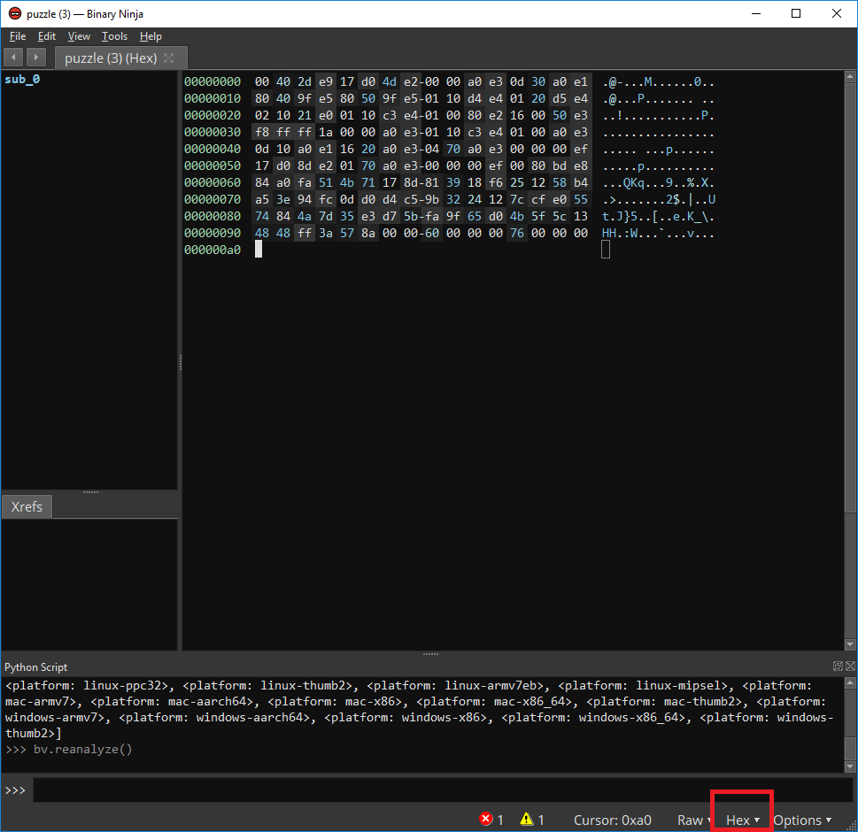

# Title

Bicep Carapace

# hint

Figuring out what it is is fun.

[puzzle](puzzle)

# solution

What is it? a raw binary for ARM32, little endian. How did I know? (Bicep = ARM).
I just told IDA to open the file as 32bit Little Endian ARM
starting at address 0 and ended up with the disassembly show below.



If you decode it as big endian arm, the assembly just doesn't look right. We know we're on the right track with
little endian in part because the first instruction is commonly part of a function preamble (allocating 0x17 bytes of stack).

Ok, so looking at the disassembly, R4 gets a pointer to location "60" and R5 gets a pointer to location "76".
loc_18 is referred to by a loop (offset 30). So, it looks like we have a loop and the code looks something like:

```c
int r0 = 0;
char *r4 = &byte60, *r5 = &byte76;
char r13[0x17];

for (r0 = 0; r0 < 0x16; r0++) {
    // magic happens
}
```

Now, what magic happens?

```
    {
        char r1, r2;
        r1 = r4[r0];
        r2 = r5[r0];
        r1 = r1 ^ r2;
        r13[r0] = r1;
    }
```

In otherwords, all this code does is XOR the string starting at 0x60 with the string starting at 0x76 and store the result on the stack. As it turns out, this XOR'd string is our key.

```
char byte60[] = {;
    0x84, 0xA0, 0xFA, 0x51, 0x4B, 0x71, 0x17, 0x8D, 0x81, 0x39, 0x18,
    0xF6, 0x25, 0x12, 0x58, 0xB4, 0xA5, 0x3E, 0x94, 0xFC, 0x0D, 0xD0,
};
char byte76[] = {
    0xD4, 0xC5, 0x9B, 0x32, 0x24, 0x12, 0x7C, 0xCF, 0xE0, 0x55, 0x74, 
    0x84, 0x4A, 0x7D, 0x35, 0xE3, 0xD7, 0x5B, 0xFA, 0x9F, 0x65, 0xD0, 
};

int r0 = 0;
char *r4 = &byte60, *r5 = &byte76;
char r13[0x17];

memset(r13, 0, sizeof(r13));
for (r0 = 0; r0 < 0x16; r0++) {
        char r1, r2;
        r1 = r4[r0];
        r2 = r5[r0];
        r1 = r1 ^ r2;
        r13[r0] = r1;
}
printf("%s\n", r13);
```

# Author

[jason@thought.net](mailto:jason@thought.net), [@risenrigel](https://twitter.com/risenrigel)


# alternative method

Let's say you didn't have IDA, but could install the cross binutils for ARM32 little endian (or had access to a raspberry pi with binutils installed). It is totally possible to solve this challenge with just those tools.

```sh
# convert the raw binary to something with an ELF header
objcopy -I binary -O elf32-little -B armv5t puzzle puzzle.o
# disassemble the new file
objdump --disassemble-all -m armv5t puzzle.o
```

And here's the disassembly I got. It looks pretty similar to the IDA disassembly, but IDA has been
kind to us and worked some arithmetic for us.

```
puzzle.o:     file format elf32-little


Disassembly of section .data:

00000000 <_binary_puzzle_start>:
   0:	e92d4000 	stmfd	sp!, {lr}
   4:	e24dd017 	sub	sp, sp, #23
   8:	e3a00000 	mov	r0, #0
   c:	e1a0300d 	mov	r3, sp
  10:	e59f4080 	ldr	r4, [pc, #128]	; 98 <_binary_puzzle_start+0x98>
  14:	e59f5080 	ldr	r5, [pc, #128]	; 9c <_binary_puzzle_start+0x9c>

```

The two LDR statements above look strange because they are PC relative loads, so the first is: R4 gets what ever value is at 0x10 (the current program counter) + 128. I.e. R4 = the value at 0x90 which is 0x60. Similarly, R5 gets the value stored at 0x94 (0x14 + 128), which happens to be 0x76.

What follows is the loop:

```
  18:	e4d41001 	ldrb	r1, [r4], #1
  1c:	e4d52001 	ldrb	r2, [r5], #1
  20:	e0211002 	eor     r1, r1, r2
  24:	e4c31001 	strb	r1, [r3], #1
  28:	e2800001 	add     r0, r0, #1
  2c:	e3500016 	cmp     r0, #22
  30:	1afffff8 	bne	18 <_binary_puzzle_start+0x18>
```

Ensure there's a null byte at the end of the string:

```
  34:	e3a00000 	mov     r0, #0
  38:	e4c31001 	strb	r1, [r3], #1
```

And finally, call write(1, str, 0x16)

```
  3c:	e3a00001 	mov     r0, #1
  40:	e1a0100d 	mov     r1, sp
  44:	e3a02016 	mov     r2, #22
  48:	e3a07004 	mov     r7, #4
  4c:	ef000000 	svc	0x00000000
```

unwind the stack (why?! we're going to call exit next =)

```
  50:	e28dd017 	add	sp, sp, #23
```

call exit():

```
  54:	e3a07001 	mov	r7, #1
  58:	ef000000 	svc	0x00000000
```

return (in a good world, this line will never run):

```
  5c:	e8bd8000 	ldmfd	sp!, {pc}
```

# Solution using Binary Ninja

I'm normally a fan of [binary ninja](https://binary.ninja/), but one thing I had yet to figure out how to do is
to tell binja to load an arbitrary binary and treat it as a specific binary type. So, here it is several weeks
after the Hackers Challenge and I finally figured out how to do it.

Load the binary into binja as normal and it will show up in the hex view.



Now, use the script console (View|Script Console) and you'll get a python prompt. We need to tell binja to interpret
the loaded bytes as 32 bit ARM (little endian). To do so:

```
bv.arch = Architecture['armv7']
bv.platform = Platform['linux-armv7']
bv.add_function(0)
bv.reanalyze()
```

Now, when I select the Graph view, I get the following.


To see what's at offset 0x98 and 0x9c, I switch to linear view.


If you're curious what all architectures and platforms binja supports, try:

```
list(Architecture)
list(Platform)
```
