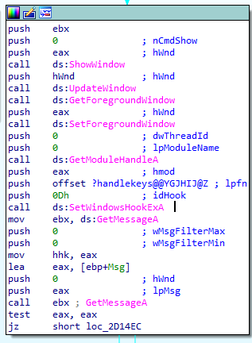
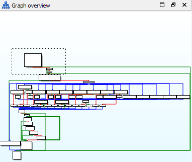
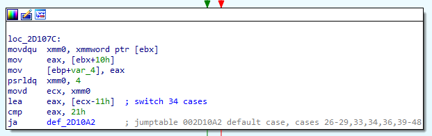
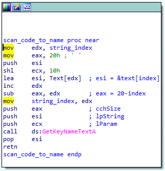

# Title

keylogger

# hint

(Not actual malware, but it may be flagged as such)

[keylogger.exe](keylogger.exe)

# solution

This is a windows executable which does windows normal initialization stuff... to begin with.
It creates a window for itself and then it installs a
[low level keyboard handler hook](https://msdn.microsoft.com/en-us/library/ms644985(v=VS.85).aspx).
This installed hook
(show below in the disassembly), gets called by the windows kernel everytime there is a keyboard
event (key press or key release).



Looking at the graph view of the handle keys function, I observed that it has a bunch of branches
(most likely a switch statement).



The first part does some basic checking commonly required for windows hook functions. It checks that the
event type is a key event and that it's a "key down" event". Failing either test, it just calls
CallNextHook() and returns. So, whatever this mess does, it looks for key press events and ignores everything
else.

The disassembly below looks at the integer 4 bytes from the start of the structure passed to handlekeys().
Keyevent handlers get passed a
[KBDLLHOOKSTRUCT](https://docs.microsoft.com/en-us/windows/desktop/api/winuser/ns-winuser-tagkbdllhookstruct).
So, the dance with the xmm registers results in ECX containing a keyboard "scan code" (which is NOT a key...
it's a kind of coordinate on the keyboard that the kernel would map back into the appropriate key name, e.g. 'Q', 'W', 'E', etc.)



At the bottom of the code below, there is a jump though a jump table (switch statement). Below is a representative portion of the case statement. The top box is reached if the scan code is 20 (decimal!). If the result index (I called it "string_index") happens, to be 8, then it calls scan_code_to_name(). Like wise, if the scan code 17 is seen and we're currently at index 4 or index 5, then scan_code_to_name() is called.


So, what does scan_code_to_name() do? (below). It asks the kernel to translate the scan code to a key name using
[GetKeyNameText](https://docs.microsoft.com/en-us/windows/desktop/api/winuser/nf-winuser-getkeynametexta). The
key name is stored into a buffer and the index is incremented.



So, how does one turn scan codes into key names? I wrote a test program. I know that other folks found a table
(the table I found online was just flat wrong, which cost me an hour or so). My test program, which uses
[GetKeyNameText](https://docs.microsoft.com/en-us/windows/desktop/api/winuser/nf-winuser-getkeynametexta) just
like our binary can be found here: [scancodes.cpp](scancodes.cpp). And here's the secret decoder ring:

```
key(17) -> W
key(20) -> T
key(18) -> E
key(19) -> R
key(21) -> Y
key(22) -> U
key(49) -> N
key(24) -> O
key(30) -> A
key(31) -> S
key(23) -> I
key(50) -> M
key(25) -> P
key(32) -> D
key(37) -> K
key(38) -> L
```

When this program sees enough correct key presses it shows a message box with "The key is: ...." So, we just need to use the switch statement cases and the string index comparisons to work out which characters the binary
wants to have in each location.


# Author

[jason@thought.net](mailto:jason@thought.net), [@risenrigel](https://twitter.com/risenrigel)

