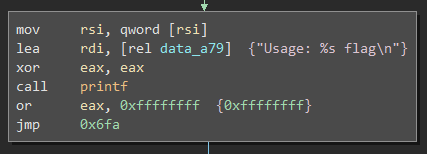
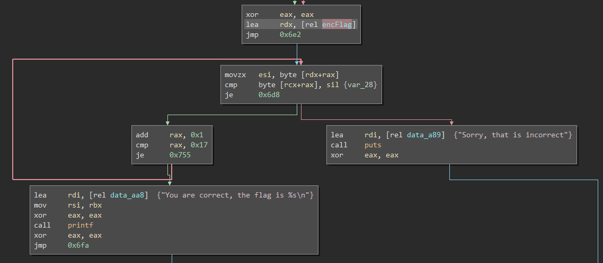
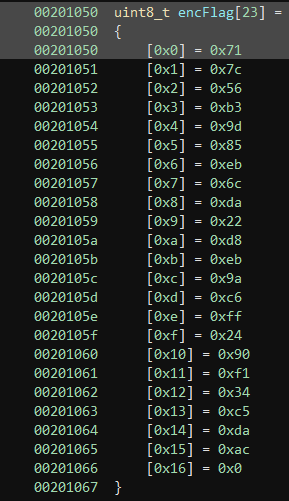
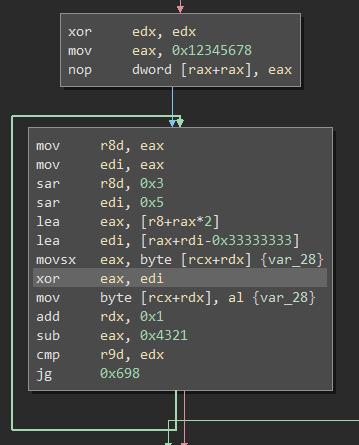

# title
PlugX

# hint

I leet hacker, none can decode my strings!

(plugx)[plugx]

# solution

Always the first place to start:

```
$ file plugx
plugx: ELF 64-bit LSB shared object, x86-64, version 1 (SYSV), dynamically linked, interpreter /lib64/ld-linux-x86-64.so.2, for GNU/Linux 3.2.0, BuildID[sha1]=9221ce239e445e342ef3bd2ad811c51693026448, not stripped
```

Ok, so it's a linux binary, so I brought it into binary ninja and looked at main. It checks argc and if it's
not 2, then it prints usage and exits.



Alright, it reads a string we typed on the command line and if it's the correct string, it prints success. It prints the success message if a byte by byte comparison of the strings at rdx[rax] == rcx[rax] succeeds.



Well,
rdx points to a byte array "encFlag" stored in the data section, and rcx points to a memory address on the stack.
So, somehow what this stack variable points to must become what is in "encFlag"



The main encryption loop (that takes our string and "encrypts" it) is shown below. One oddity about this function
is that it is a sort of
[cipher block chaining mode](https://en.wikipedia.org/wiki/Block_cipher_mode_of_operation#Cipher_Block_Chaining_(CBC))
meaning that there is an initialization value and the result of each round is used as an input into the next round.
We can inspect this by running the program and breaking on the XOR operation.



```
$ gdb ./plugx
Reading symbols from ./plugx...(no debugging symbols found)...done.
(gdb) break *(main+0xa3)
Breakpoint 1 at 0x6b3
(gdb) set args XXXXXXXXXXXXXXXXXXXXXXXXXXXXX
(gdb) run
Starting program: /mnt/c/Users/rigel/Downloads/plugx XXXXXXXXXXXXXXXXXXXXXXXXXXXXX

Breakpoint 1, 0x00000000080006b3 in main ()
(gdb) i r dil
dil            0x3f     63
(gdb) i r al
al             0x58     88
(gdb) p/c 0x3f^0x71
$1 = 78 'N'
```

0x3f is the initialization vector, 0x58 (contents of 'al') is the first X in our string. We want that 'X' to be: 'X' = 0x3f ^ 0x71 (where 0x71 is the first byte of the encrypted string). In this case 'X' = 0x3f ^ 0x71 = 0x78 = 'N'. So the first letter of the key is 'N'.  How do we get the second?

```
(gdb) set args NXXXXXXXXXXXXXXXXXXXXXXXXXXXXXXXXXXXXX
(gdb) run
The program being debugged has been started already.
Start it from the beginning? (y or n) y
Starting program: /mnt/c/Users/rigel/Downloads/plugx NXXXXXXXXXXXXXXXXXXXXXXXXXXXXXXXXXXXXX

Breakpoint 1, 0x00000000080006b3 in main ()
(gdb) c
Continuing.

Breakpoint 1, 0x00000000080006b3 in main ()
(gdb) x/i dil
No symbol "dil" in current context.
(gdb) i r dil
dil            0x19     25
(gdb) i r al
al             0x58     88
(gdb) p/c 0x19 ^ 0x7c
$2 = 101 'e'
```

We want 0x19 (the chained cipher text) ^ 0x73 (2nd byte of string) = 101 = 'e'. And for illustration purposes, here's how to get the third letter:

```
(gdb) set args NeXXXXXXXXXXXXXXXXXXXXXXXXXXXXXXXXXXXX
(gdb) run
The program being debugged has been started already.
Start it from the beginning? (y or n) y
Starting program: /mnt/c/Users/rigel/Downloads/plugx NeXXXXXXXXXXXXXXXXXXXXXXXXXXXXXXXXXXXX

Breakpoint 1, 0x00000000080006b3 in main ()
(gdb) c
Continuing.

Breakpoint 1, 0x00000000080006b3 in main ()
(gdb) c
Continuing.

Breakpoint 1, 0x00000000080006b3 in main ()
(gdb) i r dil
dil            0x20     32
(gdb) i r al
al             0x58     88
(gdb) p/c 0x20 ^ 0x56
$3 = 118 'v'
```

The string so far: NevXXXXXXXXXXXXXXXXXXXXXXXXXXXXXX

When you've run this process 23 times, you recover the whole key. The important bits to notice in the process are how the string is updated before each iteration and how the number of "continues" is increased by one each iteration.

# Author

[jason@thought.net](mailto:jason@thought.net), [@risenrigel](https://twitter.com/risenrigel)

