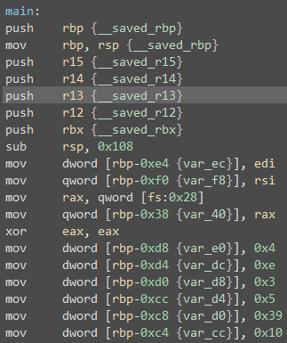
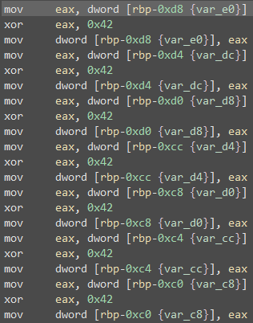

# title
RE 100

# hint

Reverse Engineering really isn't that hard.  Learn some basics.

Here is a good place to start, there's many others.

https://jlospinoso.github.io/developing/software/software%20engineering/reverse%20engineering/assembly/2015/03/06/reversing-with-ida.html

file: [puzzle](puzzle)

# solution

Ok, so what is it?

```
$ file puzzle
puzzle: ELF 64-bit LSB executable, x86-64, version 1 (SYSV), dynamically linked, interpreter /lib64/ld-linux-x86-64.so.2, for GNU/Linux 2.6.32, BuildID[sha1]=5200203cd4639524180895a2b49a7c8f989ca2b2, not stripped
```

Linux binary for x86-64, no problem. I fired up binary ninja and looked at the first part of main and
noticed it allocated some stack space and then started stuffing values into it using move instructions:



Later on, these same values are pulled from the stack and XOR'd with 0x42 and returned back to the stack space.



So, I decided to stop here and run the program, inserting a break after the last fetch/xor/store operation.


```
s$ gdb ./puzzle
GNU gdb (Ubuntu 8.1-0ubuntu3) 8.1.0.20180409-git
...
Reading symbols from ./puzzle...(no debugging symbols found)...done.
(gdb) break *0x4008a9
Breakpoint 1 at 0x4008a9
(gdb) run
Starting program: /mnt/c/Users/rigel/Downloads/puzzle

Breakpoint 1, 0x00000000004008a9 in main ()
(gdb) si
(gdb) x/40wx $rbp-0xd8
0x7ffffffede78: 0x00000046      0x0000004c      0x00000041      0x00000047
0x7ffffffede88: 0x0000007b      0x00000052      0x00000045      0x0000005f
0x7ffffffede98: 0x00000049      0x00000053      0x0000004e      0x00000054
0x7ffffffedea8: 0x0000005f      0x00000053      0x0000004f      0x0000005f
0x7ffffffedeb8: 0x00000042      0x00000041      0x00000044      0x0000005f
0x7ffffffedec8: 0x00000041      0x00000046      0x00000054      0x00000045
0x7ffffffeded8: 0x00000052      0x0000005f      0x00000041      0x0000004c
0x7ffffffedee8: 0x0000004c      0x0000007d      0x00000009      0x00000000
0x7ffffffedef8: 0xff402660      0x00007fff      0xfffedf68      0x00007fff
0x7ffffffedf08: 0x00f0b5ff      0x00000000      0x00000001      0x00000000
```

Those sure do look like ASCII characters stored in individual integers. Wonder what they say...
So I wrote the program here to see. Yea!

```c
#include <stdio.h>
int
main() {
	unsigned char s[] = {
    0x00000046, 0x0000004c, 0x00000041, 0x00000047,
    0x0000007b, 0x00000052, 0x00000045, 0x0000005f,
    0x00000049, 0x00000053, 0x0000004e, 0x00000054,
    0x0000005f, 0x00000053, 0x0000004f, 0x0000005f,
    0x00000042, 0x00000041, 0x00000044, 0x0000005f,
    0x00000041, 0x00000046, 0x00000054, 0x00000045,
    0x00000052, 0x0000005f, 0x00000041, 0x0000004c,
    0x0000004c, 0x0000007d, //0x00000009, 0x00000000
	};
	int i;

	for (i = 0; i < sizeof(s); i++) {
		printf("%c", s[i]);
	}
	printf("\n");
}
```

# Author

[jason@thought.net](mailto:jason@thought.net), [@risenrigel](https://twitter.com/risenrigel)

