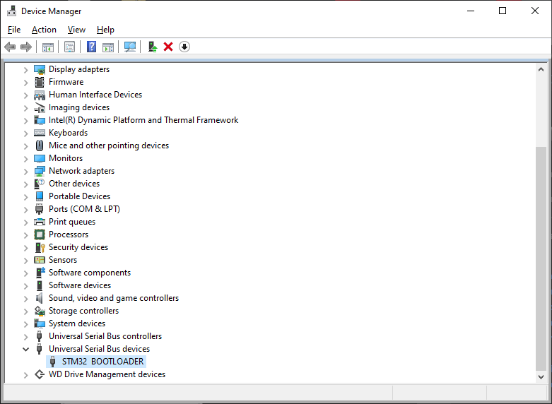
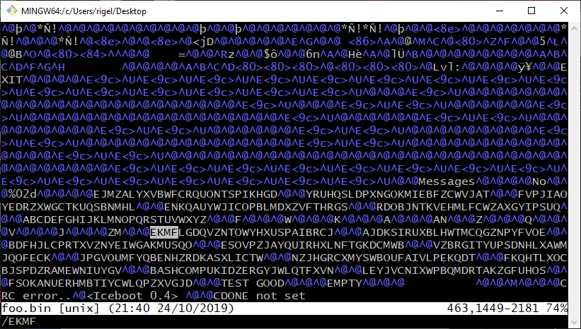

# RotorMeThis

```
Find the configuration of the 9th enigma rotor used on the badge. 26 capital letters.
```

# solution

This requires getting the firmware off the board. If you turn off the device, short the test pins,
plug in a USB micro cable, and then power on the board, it fires up in DFU mode.

Linux gives more information about the specific chip in dmesg, but Windows shows



Now you just need a utility to grab the firmware. I used
[STM32CubeProgrammer](https://www.st.com/en/development-tools/stm32cubeprog.html).

Without the part number, you have to guess at how much memory to fetch... I guessed:
1024000 in the "size" field failed with "Error: Data read failed". Then I tried,
512000, 256000... success! Clicking the triangle on the "Read" button allows you to
save the binary out.

Being the world's laziest forensics challenge solver, my go to tool for looking through
binaries is 'vi'. But what should we look for in the binary?

Well, we're looking for a rotor configuration for the Enigma. Wikipedia has everything...
including a page describing the
[rotor configs for the Enigma](https://en.wikipedia.org/wiki/Enigma_rotor_details).
Searching for 'EKMF' (Enigma I, rotor I) yields:



One of those rotor configs doesn't look very random...

## author

This walkthru brought to you by Jason L. Wright ([jason@thought.net](mailto:jason@thought.net),
[@risenrigel](https://twitter.com/risenrigel)).