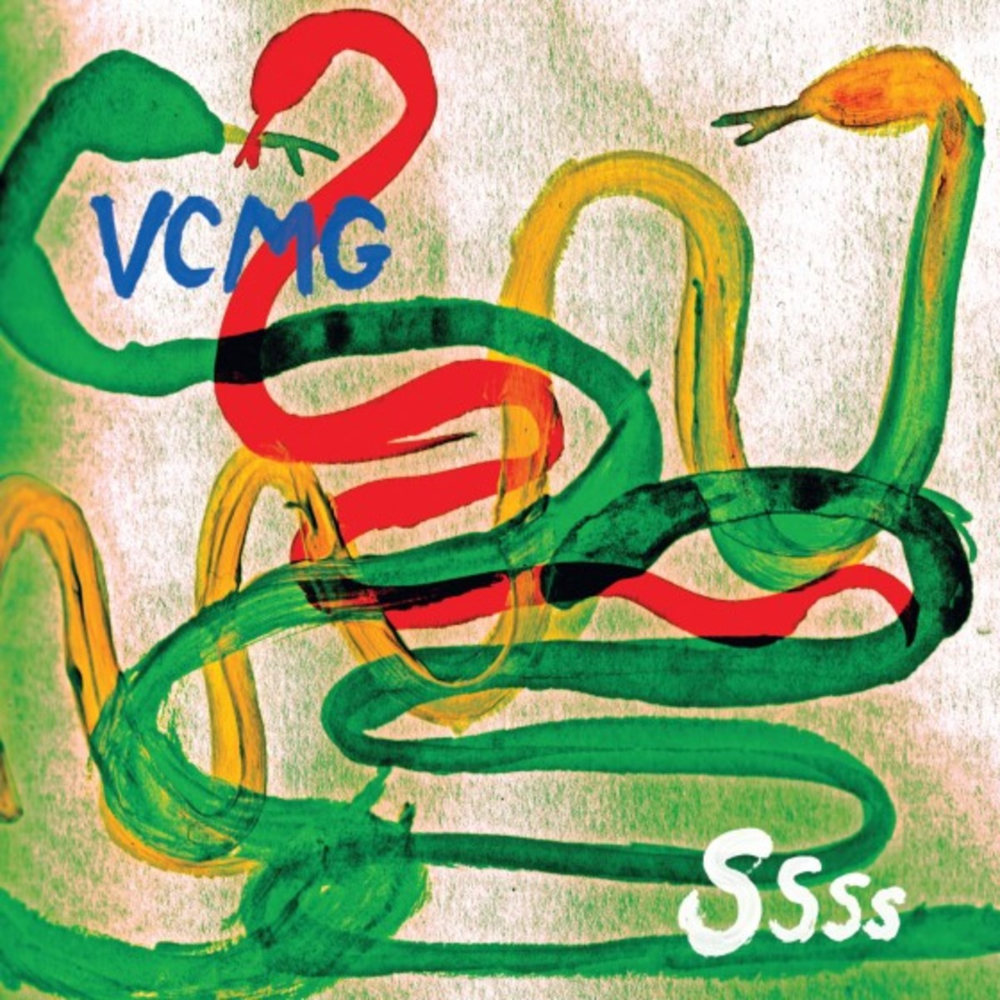

# shamr-one

## hint

```
Sometimes data is right in front of you, you just have to look deeper. 

And sometimes data needs to be combined.
```


## file



## solution

Ok, there are a couple of hints already. The title "shamr" is short for
Shamir. Specifically, the S in RSA: Adi Shamir. One of the things he's
famous for is an algorithm for secret sharing: dividing up a secret key
into shards such that any N of M (for N < M) shards can be used to
reconstruct the key.

In fact, the title of the album in the image "ssss" is a hint. There's
a Linux utility called [ssss-combine](http://www.point-at-infinity.org/ssss/)
(Shamir's Secret Sharing Scheme) which implements his algorithm.

Now... we need secret shards.

Let's look more closely at the image.

```
$ exiftool MusicToCodeTo.jpg
ExifTool Version Number         : 10.80
File Name                       : MusicToCodeTo.jpg
Directory                       : .
File Size                       : 329 kB
File Modification Date/Time     : 2019:10:26 15:47:28-06:00
File Access Date/Time           : 2019:10:26 15:47:28-06:00
File Inode Change Date/Time     : 2019:10:26 15:49:26-06:00
File Permissions                : rwxrwxrwx
File Type                       : JPEG
File Type Extension             : jpg
MIME Type                       : image/jpeg
JFIF Version                    : 1.01
Exif Byte Order                 : Big-endian (Motorola, MM)
Image Description               : sekrit-5-0614e92dde69cd91001114a52eae72835b3ee2b3a9640dca5bc97143a2ebb523c34bf3df5016c5c219febf5c20edd442694861f845f20a90cc8be22d05f00f499f643989da318078dce301e5d7686930b34d0fcbbb3fb20c52213a756a9d83af88f89daa4fa0309cfd704df1c69f276b9fac8020918eab1a2cf79394d319da2e
Camera Model Name               : Needs only 3
X Resolution                    : 150
Y Resolution                    : 150
Resolution Unit                 : inches
Y Cb Cr Positioning             : Centered
XMP Toolkit                     : Image::ExifTool 11.59
Artwork Title                   : sekrit-1-ea2e95ada0e32329acfbf0256f14094bfada45563cf46a880d7d0650e505cc162366a29ec953c211b76af5a5b9773d9d55ed7adeed6c878d113c72b722f3dd8f8e26043027d6d7da462c098fc0c03466906e9818ab1be29ee98a211e8ced197297f6d09a94eb2230ca5131608c13d70f7b7f74bd2c1f833d2455839bd677d5d8
Comment                         : sekrit-2-cc529684afe461a6b02de1cf872deac883ee4196cc654b9f67a697c2d640e7f749a81a2440c1519bb7a57da10b212c0ba22ef3d0dd8cae3a7518f8cafae99a7808405c480596fac637c5dfa3663e93046721893138cdac82578004cae8b5537af3f0119f62058228ce75d17e61a419ca9c5a0cbca48f464d140d7bad66d743a5
Image Width                     : 1200
Image Height                    : 1200
Encoding Process                : Baseline DCT, Huffman coding
Bits Per Sample                 : 8
Color Components                : 3
Y Cb Cr Sub Sampling            : YCbCr4:2:0 (2 2)
Image Size                      : 1200x1200
Megapixels                      : 1.4
```


So, we have "sekrit-1", "sekrit-2", and "sekrit-5" and the "Camera Model Name" is "Needs only 3". So, perhaps these are the shards and we need 3 of them to reconstruct the key.

```
$ exiftool MusicToCodeTo.jpg | grep sekrit | cut -f 2 -d : | cut -f 2-3 -d- | ssss-combine -t 3
WARNING: couldn't get memory lock (ENOSYS, kernel doesn't allow page locking).
Enter 3 shares separated by newlines:
Resulting secret: TheKeyIs=>XXXXXXXXXXXX
Share [1/3]: Share [2/3]: Share [3/3]:
```

And XXXXXXXXXXXXXX is the key.
