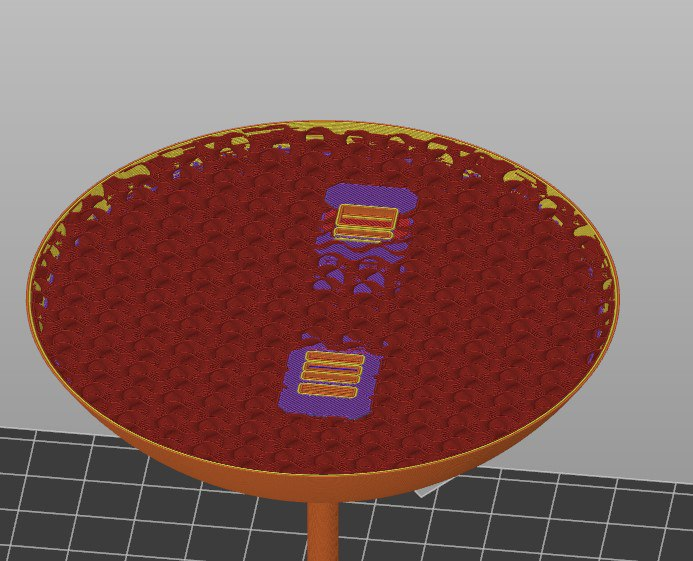
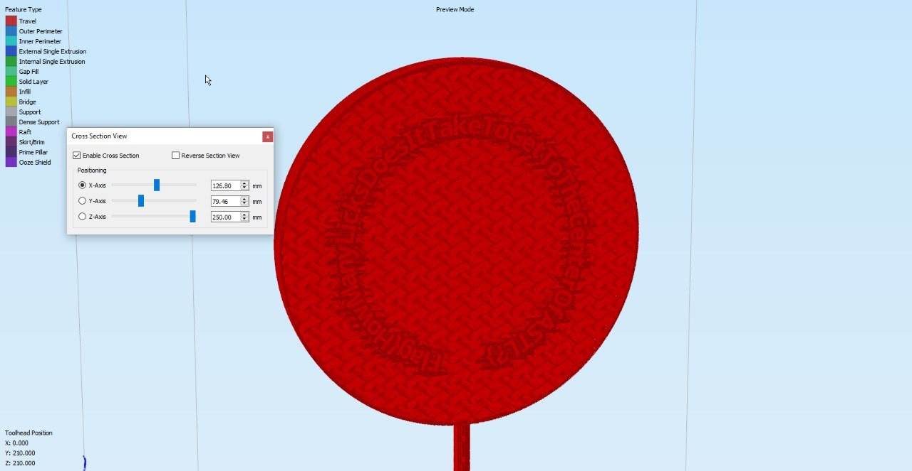

# Print This

3D printing is all the rage these days.

[lolly.zip](./lolly.zip)

## Problem

Slicing the lolly pop horizontally reveals our flag is likely inside. However, we cannot make out what the flag is.

## Solution

Import the gcode in slicing software that has a vertical cross section feature, like Simplify3D.

`flag={HowManyLicksDoesItTakeToGetToTheCenterOfASTL?}`