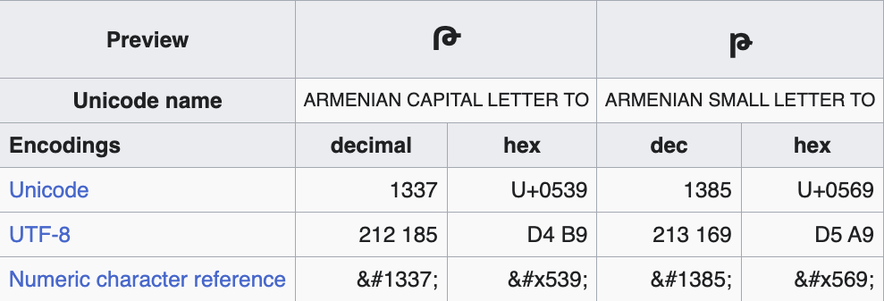

# ThisIsIt

I'll just leave this here.

https://pastebin.com/uR5WMQWq

## Solution

The 'Թ' character is the ninth letter of the Armenian alphabet. Below is a table of character information as found on Wikipedia. Does anything stand out?

The flag is: `What is 1337?`
