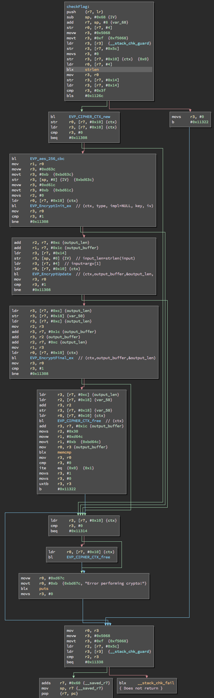
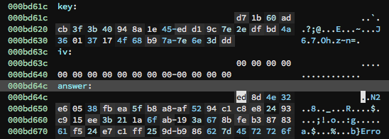

The secure IoT challenge at Saintcon 2017 was an ARM binary [here](secure).

```
$ file secure

secure: ELF 32-bit LSB executable, ARM, EABI5 version 1 (SYSV), dynamically
linked, interpreter /lib/ld-linux-armhf.so.3, for GNU/Linux 3.2.0,
BuildID[sha1]=c81d804401ab92ab5a125712ca0862f8d8200bc2, not stripped
```

Looking at checkFlag, the disassembly looks like the below according to
Binary Ninja.  Important facts: the first four integer arguments are
passed in registers `r0`, `r1`, `r2`, and `r3` (in that order).
Additional arguments are passed relative to the `sp` (e.g. `sp, #4`).



Pseudo code for this function:

```c
checkFlag(char *input) {
	static uint8_t key[32] = { ... };
	static uint8_t iv[16] = { ... };
	static uint8_t answer[48] = { ... };
	EVP_CIPHER *cipher;
	EVP_CIPHER_CTX *ctx;
	int len, outlen;

	len = strlen(input);
	cipher = EVP_aes_256_cbc;
	ctx = EVP_CIPHER_CTX_new();
	if (ctx == NULL) {
		// error handling
		return;
	}
	EVP_EncryptInit_ex(ctx, cipher, NULL, key, iv);
	EVP_EncryptUpdate(ctx, output_buffer, &outlen, input,
	    strlen(input));
	EVP_EncryptFinal_ex(ctx, output_buffer+outlen, &outlen);
	if (memcmp(answer, output_buffer, 48) == 0)
		// success!
}
```

In other words, this function encrypts whatever we specify on the
commandline with AES-256-CBC using a key and initialization vector
*in the binary*. The result is compared against an encrypted blob
*in the binary*.

The key is at `0xbd61c`, the IV is at `0xbd63c`, and the encrypted
blob is at `0xbd64c`.



Here's a program that does the decryption.  The flag comes out in
the result.

```c

#include <sys/types.h>
#include <openssl/evp.h>
#include <stdint.h>
#include <string.h>
#include <err.h>

const uint8_t answer[48] = 
{
	0xed, 0x8d, 0x4e, 0x32, 0xe6, 0x05, 0x38, 0xfb, 0xea, 0x5f, 0xb8, 0xa8, 0xaf, 0x52, 0x94, 0xc1,
	0xc8, 0xe8, 0x24, 0x93, 0xc9, 0x15, 0xee, 0x3b, 0x21, 0x1a, 0x6f, 0xab, 0x19, 0x3a, 0x67, 0x8b,
	0xfe, 0xb3, 0x87, 0x83, 0x61, 0xf5, 0x24, 0xe7, 0xc1, 0xff, 0x25, 0x9d, 0xb9, 0x86, 0x62, 0x7d
};

const uint8_t key[32] = {
	0xd7, 0x1b, 0x60, 0xad, 0xcb, 0x3f, 0x3b, 0x40, 0x94, 0x8a, 0x1e, 0x45, 0xed, 0xd1, 0x9c, 0x7e,
	0x2e, 0xdf, 0xbd, 0x4a, 0x36, 0x01, 0x37, 0x17, 0x4f, 0x68, 0xb9, 0x7a, 0x7e, 0x6e, 0x3d, 0xdd
};

const uint8_t iv[16] = 
{
	0x00, 0x00, 0x00, 0x00, 0x00, 0x00, 0x00, 0x00, 0x00, 0x00, 0x00, 0x00, 0x00, 0x00, 0x00, 0x00
};

int
main() {
	EVP_CIPHER_CTX *ctx = NULL;
	const EVP_CIPHER *cipher;
	uint8_t output[sizeof(answer)+1];
	int outlen, tmplen;

	ctx = EVP_CIPHER_CTX_new();
	if (ctx == NULL) {
		warnx("bad malloc");
		goto errout;
	}

	cipher = EVP_aes_256_cbc();

	if (!EVP_DecryptInit_ex(ctx, cipher, NULL, key, iv)) {
		warnx("init failed");
		goto errout;
	}

	memset(output, 0, sizeof(output));
	outlen = sizeof(answer);
	if (!EVP_DecryptUpdate(ctx, output, &outlen, answer, sizeof(answer))) {
		warnx("update failed");
		goto errout;
	}

	if (!EVP_DecryptFinal_ex(ctx, output+outlen, &tmplen)) {
		warnx("final failed");
		goto errout;
	}

	EVP_CIPHER_CTX_free(ctx);

	printf("%s\n", output);
	return (0);

errout:
	if (ctx != NULL)
		EVP_CIPHER_CTX_free(ctx);
	return (1);
}
```

And here's my Binary Ninja [database](secure.bndb).  This walkthrough
brought to you by Jason L. Wright (jason@thought.net, @risenrigel)
